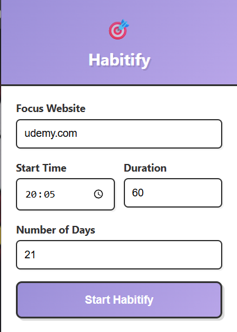
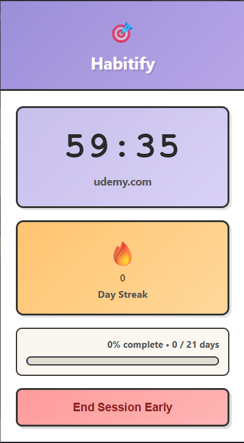
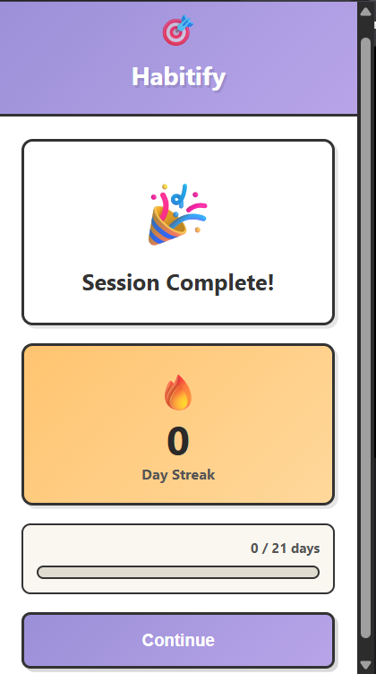
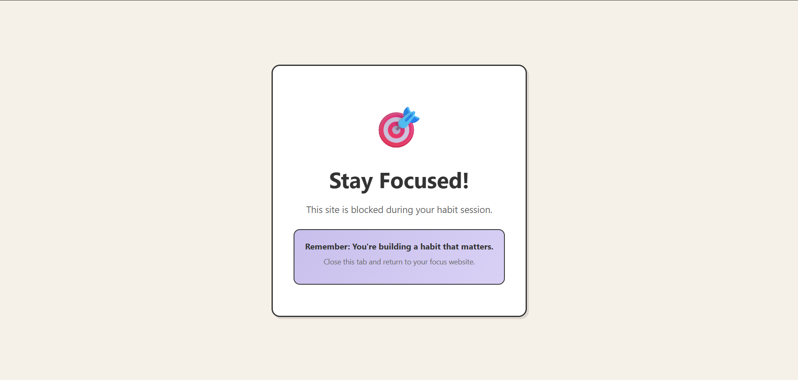

# 🎯 Habitify - Build Habits Through Focus

A Chrome extension that helps you build lasting habits by blocking distracting websites during scheduled focus sessions.

## ✨ Features

- **⏰ Scheduled Focus Sessions** - Set daily times for your habit-building sessions
- **🚫 Smart Website Blocking** - Automatically blocks all websites except your chosen focus site
- **🔥 Streak Tracking** - Visual streak counter to keep you motivated
- **📊 Progress Monitoring** - Track your progress toward your habit goal
- **⏱️ Live Timer** - Real-time countdown during active sessions

## 🚀 How It Works

1. **Choose Your Focus** - Select the website you want to focus on (e.g., Duolingo for language learning)
2. **Set Your Schedule** - Pick a daily time and session duration
3. **Build Your Habit** - Set how many days you want to build this habit (21+ days recommended)
4. **Stay Focused** - During your session, only your chosen website works - everything else is blocked
5. **Track Your Streak** - Complete sessions daily to build your streak and reach your goal

## 📦 Installation

### Manual Installation (Developer Mode)
1. Download the latest release
2. Open Chrome and go to `chrome://extensions/`
3. Enable "Developer mode" (toggle in top-right)
4. Click "Load unpacked"
5. Select the `habitify` folder
6. Done! Click the extension icon to start
7. Make sure to turn on background sync from extension settings

## 🎮 Usage

### Setting Up Your First Habit

1. Click the Habitify icon in your Chrome toolbar
2. Enter your focus website (e.g., `duolingo.com`)
3. Set your daily start time (e.g., `8:00 PM`)
4. Choose session duration (recommended: 30-60 minutes)
5. Set your habit goal (recommended: 21 days minimum)
6. Click "Start Habit Schedule"

### During a Session

- ✅ Your chosen website works normally
- 🚫 All other websites are blocked
- ⏱️ Live timer shows remaining time
- 🔥 Your current streak is displayed

### After Completing a Session

- 🎉 Session marked as complete
- 🔥 Streak automatically increments
- 📊 Progress bar updates
- 🔔 Success notification (optional)

## ⚙️ Settings

- **Website URL** - The site you want to focus on (no need for https://)
- **Start Time** - When your daily session should begin
- **Duration** - How long each session lasts (5-180 minutes)
- **Total Days** - Your habit-building goal

## 🛠️ Technical Details

**Built With:**
- Manifest V3 (latest Chrome extension standard)
- Vanilla JavaScript (no frameworks)
- Chrome Storage API
- Chrome Alarms API
- Chrome Tabs API

**Permissions Required:**
- `storage` - Save your habits and progress
- `alarms` - Schedule daily sessions
- `tabs` - Block distracting websites
- `notifications` - Session completion alerts (optional)

**Browser Support:**
- Chrome 88+
- Edge 88+ (Chromium-based)
- Brave, Opera, Vivaldi (Chromium-based browsers)

## 🔒 Privacy

Habitify respects your privacy:
- ✅ All data stored locally on your device
- ✅ No data sent to external servers
- ✅ No tracking or analytics
- ✅ No account required
- ✅ Open source - verify the code yourself

## 📸 Screenshots

### Setup Screen


### Active Session


### Session Complete


### Blocked Page


## 🤝 Contributing

Contributions are welcome! Please feel free to submit a Pull Request.

1. Fork the repository
2. Create your feature branch (`git checkout -b feature/AmazingFeature`)
3. Commit your changes (`git commit -m 'Add some AmazingFeature'`)
4. Push to the branch (`git push origin feature/AmazingFeature`)
5. Open a Pull Request

## 🐛 Bug Reports

Found a bug? Please [open an issue](https://github.com/yourusername/habitify/issues) with:
- Browser version
- Extension version
- Steps to reproduce
- Expected vs actual behavior

## 📝 Changelog

### Version 0.0.1 (Initial Release)
- ✨ Scheduled focus sessions
- 🚫 Website blocking
- 🔥 Streak tracking
- 📊 Progress monitoring
- ⏱️ Live timer countdown

## 🗺️ Roadmap

- [ ] Multiple habits support
- [ ] Statistics dashboard
- [ ] Custom whitelist/blacklist
- [ ] Break reminders (Pomodoro style)
- [ ] Export habit data
- [ ] Dark mode

## 📄 License

MIT License - feel free to use this project however you'd like!

## 💖 Support

If Habitify helps you build better habits, consider:
- ⭐ Starring the repository
- 📢 Sharing with friends

## 👨‍💻 Author

**Your Name**
- GitHub: [@0ManasVerma0](https://github.com/0ManasVerma0)
- Twitter: [@manasVtxt](https://twitter.com/manasVtxt)

## 🙏 Acknowledgments

- Inspired by my needs
- Built with ❤️ for people trying to build better habits

---

**Start building habits that stick! 🎯**


## 📦 How to Package Your Extension

### **Step 1: Prepare Your Files**

Make sure your folder structure looks like this:
```
habitify/
├── manifest.json
├── popup.html
├── popup.js
├── styles.css
├── background.js
├── blocked.html
├── logo.png (128x128)
├── README.md (optional for distribution)
├── Screenshots
└── icons/ (optional)
    ├── icon16.png
    ├── icon48.png
    └── icon128.png
```